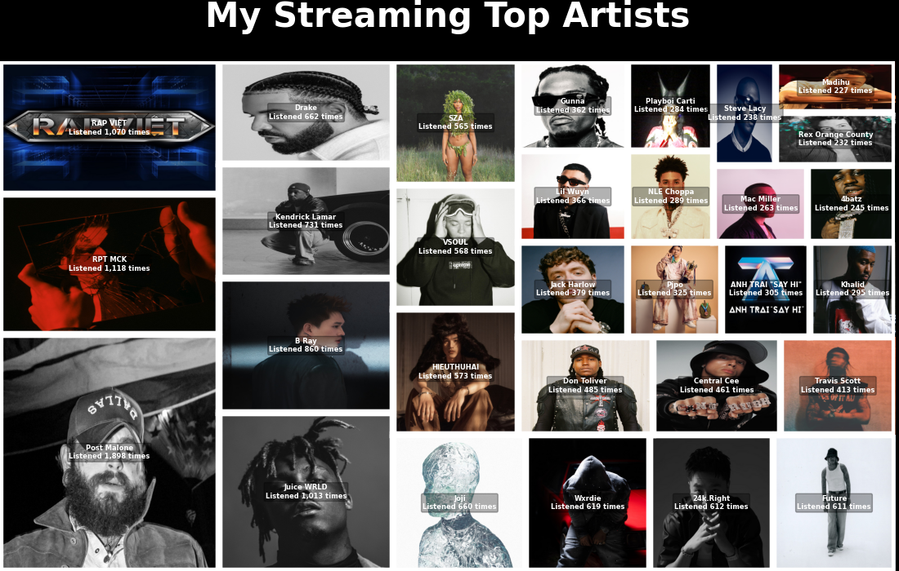

# My Spotify Activities

This project digs deep into my **Spotify listening history** — from the chaotic playlist experiments of my early days to the late-night “just one more track” spirals 🎧.  
From guilty pleasures I swore I’d never admit, to lo-fi beats that fueled both focus and procrastination, this is my **personal soundtrack archive**.

## Project information
- **Conducted by**: Tai Nguyen *(tainguyen0604@gmail.com)*
- **Period**: Aug 11th – Aug 13th 2025 *(Data exported from Spotify – timestamps normalized to UTC+7)*
- **Contribution breakdown:**
    | Source             | Description                                                                  | %     |
    |--------------------|-------------------------------------------------------------------------------|-------|
    | **Self-conducted** | Data cleaning, playlist archaeology and decoding 10+ years of streaming logs| 70%   |
    | **AI-assisted**    | Parsing JSON hybrids and chart styling therapy| 20%   |
    | **Google research**| *“How to make Seaborn charts look less like default Excel outputs”*            | 10%   |
    > ***Behind the scenes**: The “Spotify Extended Streaming History” folder is basically my musical autobiography — uncomfortably accurate.*

## Project objectives
1. **Analyze my complete streaming history**: every track, artist, album and playlist I’ve ever emotionally dumped my ears into  
2. Discover **listening patterns** by mood and time of day — also, spot those “life-is-a-mess” chapters where music was basically my emotional crutch  
3. Identify my **most-played songs, artists and albums** — aka the soundtrack to my questionable life choices  
4. My music taste: rap (US-UK), Vietnamese rap, slow R&B and that *sadness vibe* you play at 2 AM when the ceiling fan starts judging you  
5. Visualize **trends over years, months and hours of the day** — watch my mental state in pretty graphs  

## Contents
- `notebooks/my-spotify-activity-2025-08-11.ipynb`: main notebook containing the full analysis
- `outputs/images/`: saved visualizations & summary charts
- `requirements.txt`: Python dependencies for data processing & visualization
- `README.md`: project overview and usage guide (this file)

## Tools used
- **Python**: `ipython`, `pandas`, `numpy`, `matplotlib`, `seaborn`, `re`, `json`, `os`, `zoneinfo`
- **Jupyter Notebook**
- Data exported from **Spotify’s “Download Your Data” tool** (including Extended Streaming History)

## Notes
- All personal data has been **anonymized** where appropriate.
- Timestamps converted to **UTC+7** for time-based analysis.
- Dataset covers complete playback history, playlists and library snapshots.
- This is not a *music recommendation* project — it’s **data-driven nostalgia**.

---
> *"Turns out my most streamed year is... literally right now — I’m peaking in Spotify, not in life 🎧."*  
> *"Apparently, the more hours I spend on music, the deeper my introvert arc gets. Shoutout to Post Malone, Juice WRLD and MCK for being my emotional support background noise."*
