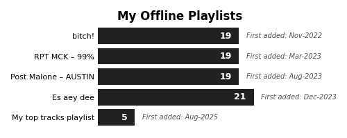

# **MY SPOTIFY ACTIVITIES**
**From 2020 to 2025-08-04*
# **0. Table of contents**
- '0. Table of contents
- I. Import Library
- II. Prepared functions
  - II.1. Function to FIX FONT ERRORS
- III. MARQUEE
  - III.1. Import MY MARQUEE
  - III.2. MY MARQUEE contributions
- IV. MY OFFLINE PLAYLISTs
  - IV.1. Import MY OFFLINE PLAYLISTs
  - IV.2. MY PLAYLISTs track contributions
  - IV.3. MY OFFLINE PLAYLISTs track by month
- V. PREPARED dataset and thumbnails
  - V.1. Import MY STREAMINGs
  - V.2. Import TRACK THUMBNAILs
    - V.2.1. List TRACK IDs
    - V.2.2. Import TRACK THUMBNAIL by Embed API
    - V.2.3. Download TRACK THUMBNAIL
    - V.2.4. Save TRACK THUMBNAIL to a files
    - V.2.5. Import TRACK THUMBNAIL from saved files
  - V.3. Import ARTIST THUMBNAILs
    - V.3.1. Import ARTIST THUMBNAILs by Client API
    - V.3.2. Download ARTIST THUMBNAILs
    - V.3.3. Save ARTIST THUMBNAILs to a files
    - V.3.4. Import ARTIST THUMBNAILs from saved files
  - V.4. Import ALBUM THUMBNAILs
    - V.4.1. Import ALBUM THUMBNAILs by Client API
    - V.4.2. Download ALBUM THUMBNAILs
    - V.4.3. Save ALBUM THUMBNAILs to a files
    - V.4.4. Import ALBUM THUMBNAILs from saved files
  - V.5. Merge MY STREAMINGs and TRACK THUMBNAILs
- VI. MY STREAMINGs
  - VI.1. MY STREAMINGs Media Types contributions
  - VI.2. TOP 20 MY STREAMINGs audio tracks
  - VI.3. TOP 20 MY STREAMINGs audio artists
  - VI.4. TOP 20 MY STREAMINGs audio albums
  - VI.5. MY STREAMINGs by year
  - VI.6. MY STREAMINGs by month
  - VI.7. MY STREAMINGs Top Artist by month
    - VI.7.+ [THUMBNAIL] MY STREAMINGs Top Artist by month
  - VI.8. MY STREAMINGs Top Audio Track by month
    - VI.8.+ [THUMBNAIL] MY STREAMINGs Top Audio Track by month
  - VI.9. MY STREAMINGs Top Album by month
    - VI.9.+ [THUMBNAIL] MY STREAMINGs Top Album by month
  - VI.10. MY STREAMINGs by hour
  - VI.11. MY STREAMINGs over time
- THE END

### **I. Import Library**

### **II. Prepared functions**

# **III. MARQUEE**
## **III.2. MY MARQUEE contributions**

# **IV. MY OFFLINE PLAYLISTs**
## **IV.2. MY PLAYLISTs track contributions**

## **IV.3. MY OFFLINE PLAYLISTs track by month**

### **V. PREPARED dataset and thumbnails**

# **VI. MY STREAMINGs**
## **VI.1. MY STREAMINGs Media Types contributions**

## **VI.2. TOP 20 MY STREAMINGs audio tracks**

## **VI.3. TOP 20 MY STREAMINGs audio artists**

## **VI.4. TOP 20 MY STREAMINGs audio albums**

## **VI.5. MY STREAMINGs by year**

## **VI.6. MY STREAMINGs by month**

## **VI.7. MY STREAMINGs Top Artist by month**

### **VI.7.+ [THUMBNAIL] MY STREAMINGs Top Artist by month**

## **VI.8. MY STREAMINGs Top Audio Track by month**

### **VI.8.+ [THUMBNAIL] MY STREAMINGs Top Audio Track by month**

## **VI.9. MY STREAMINGs Top Album by month**

### **VI.9.+ [THUMBNAIL] MY STREAMINGs Top Album by month**

## **VI.10. MY STREAMINGs by hour**

## **VI.11. MY STREAMINGs over time**

# **THE END**